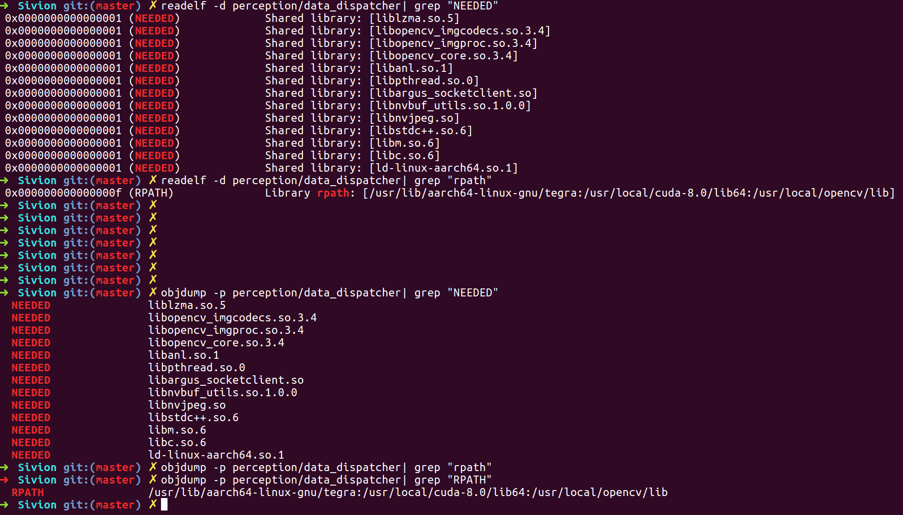

# Sivion

## 好的论文

### 关于 FreeSpace 和 Stixel

https://zhuanlan.zhihu.com/p/27494151


## data_dispatcher


仓库：DragonFly

目录：perception/stereo_vision

在perception/stereo_vision/CMakeLists.txt，有如下语句：

    add_executable(data_dispatcher dispatcher_main.cpp)
    target_link_libraries(data_dispatcher
            yaml-cpp
            df_adapter
            nanomsg
            glog
            )

## df_adapter

仓库：DragonFly

目录：df_adapter

df_adapter/PI_DragonFly/libPI_DragonFly.a

在df_adapter/CMakeLists.txt，针对"AArch64"有如下语句：

```
set(SOURCE_FILES
    src/dragonfly_datasource.cpp
    src/dragonfly_dataset_parser.cpp
    src/dragonfly_rtdata.cpp
    src/data_sender/local_callback_sender.cpp
    src/data_sender/transport_protocol_sender.cpp
    )

```