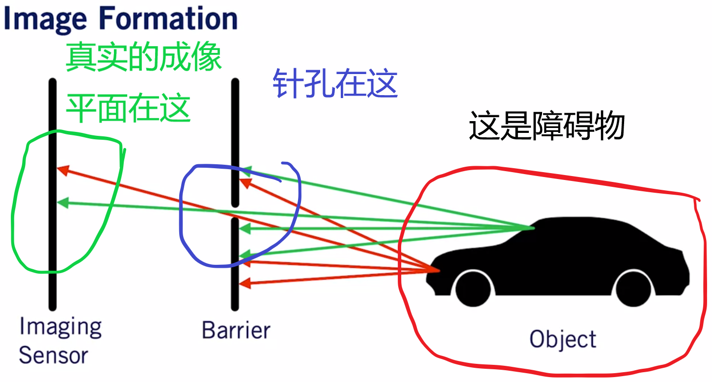
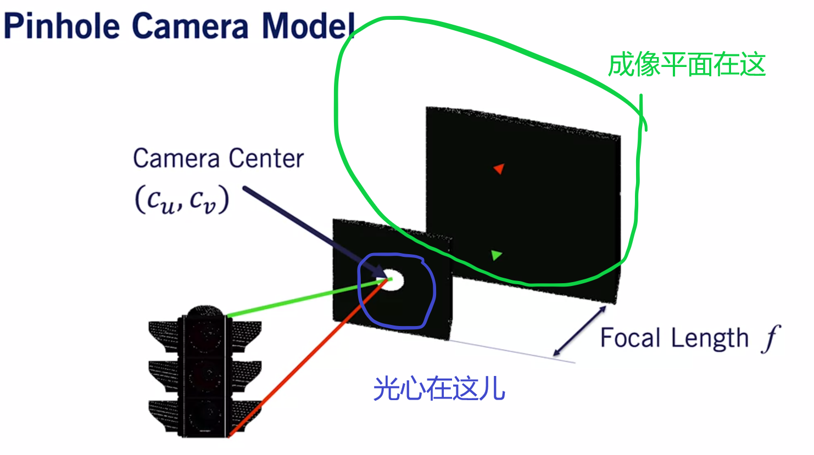
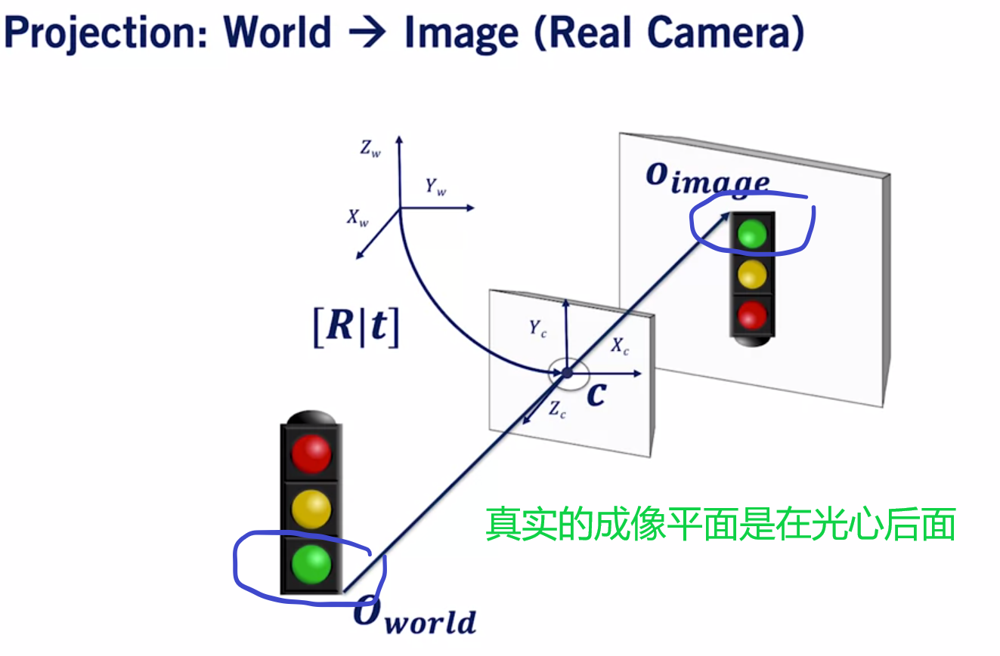
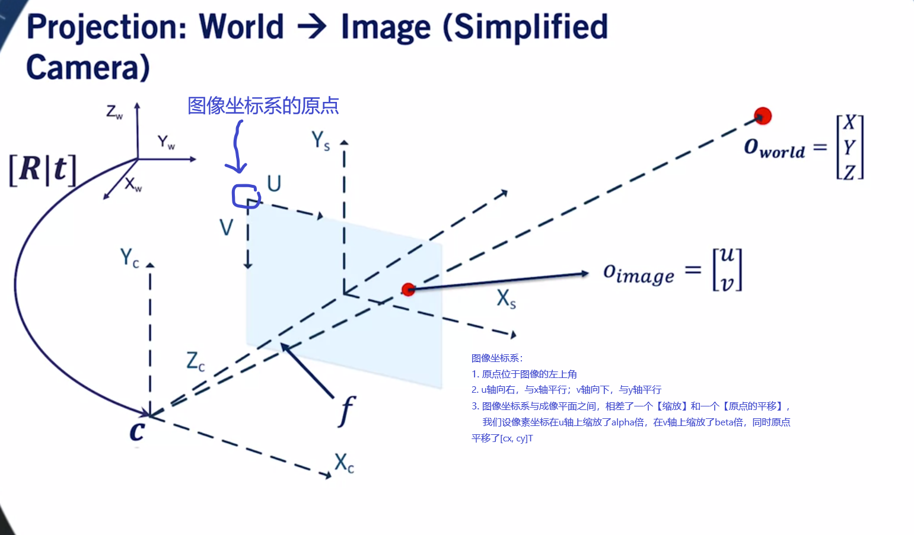

## 真实的世界

如果按照真实的情况走，就会出现倒影现象(flipped images)。

## 虚拟的成像平面(image plane)

- 真实的成像平面是在光心的后面，为了避免“倒影现象”，就虚拟出一个在光心前面的成像平面，这个成像平面位于障碍物与光心之间；
- 《视觉slam十四讲》第5讲 “相机与图像”有提到
  “为了简化模型，我们可以把成像平面对称到相机前方，和三维空间点一起放在摄像机坐标系的同一侧。”
  “这只是我们处理真实世界与相机投影的数学手段，并且，大多数相机输出的图像并不是倒像——相机自身的软件会帮你翻转这张图像，所以你看到的一般是正着的像，也就是对称的成像平面的像。”

## 坐标系的定义

### 图像坐标系

## 相机标定

### 参考论文

阿里云 <1-hw-cameras> -> calibration -> <STANFORD_CS231A_01-camera-models.pdf>
阿里云 <1-hw-cameras> -> calibration -> <UCI_The_Pinhole_Camera_cameracalib.pdf>
阿里云 <1-hw-cameras> -> calibration -> <CMU_16-385_Computer_Vision_KrisKitani_11.1_Camera_matrix.pdf>
阿里云 <1-hw-cameras> -> calibration -> <CMU_15-463_Geometric_camera_models_and_calibration_lecture13.pdf>

Intrinsics and distortion

### Intrisics

- fx, fy

fx - The x-axis focal length of the camera in pixels, is a float

fy - The y-axis focal length of the camera in pixels, is a float

[DragonFly Hardware Spec]文档上写的"Focal Length"是3.68mm，"Pixel size"是"H: 3 um, V: 3 um"，所以在x轴（horizontal）上一共有3.68 * 1000 / 3 = 1226.67pixels，在y轴（Vertical）上一共有3.68 * 1000 / 3 = 1226.67pixels。就以ID_20180823012这根棍子来说，其标定文件camchain-imucam-dynamic_a_at20191113_1659.yaml显示，cam0的fx = 1229.1636585111332, fy = 1230.2951017057933。cam1的fx = 1230.7717079222948，fy = 1232.009750644679。可以看到，cam0/cam1的fx/fy与理论值1226.67pixels是非常接近的。

- cx, cy

cx - The x-axis optical center of the camera in pixels, is a float

cy - The y-axis optical center of the camera in pixels, is a float

[DragonFly Hardware Spec]文档上写的"Resolution"是1280 * 720，所以理论上光心(optical center)的位置应该是640 * 360。就以ID_20180823012这根棍子来说，其标定文件camchain-imucam-dynamic_a_at20191113_1659.yaml显示，cam0的cx = 636.5949512577057, cy = 357.29382401434384，cam1的cx = 653.1282985654371, cy = 374.53636858681324。可以看到cam0/cam1的cx与理论值640是很接近的，而cy与理论值360也是很接近的。